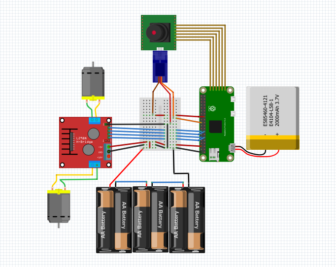

# Little Rescuer

## Descripción

"Little Rescuer" es el prototipo de un robot autónomo diseñado para intervenir rápidamente en situaciones de emergencia en la carretera. Este dispositivo, con forma de automóvil compacto, está equipado con una variedad de funciones para garantizar la seguridad y el bienestar de los conductores y pasajeros involucrados en un accidente.

Cuando se produce un accidente, "Little Rescuer" se tiene que dejar en el suelo para que rápidamente se desplace y se posicione estratégicamente a 200 metros detrás del vehículo afectado.

Una vez en posición, "Little Rescuer" despliega una cámara que puede girar 180 grados, para capturar imágenes de la escena del accidente. Estas imágenes se envían de inmediato  a los contactos de emergencia designados por el conductor, proporcionando una rápida confirmación de que todos están bien. Una vez realizado el aviso, dicha cámara gira y se queda enfocando al tráfico para ir controlándolo.

Además de tomar fotografías, "Little Rescuer" activa su luz rotativa de emergencia V-16 para alertar a otros conductores sobre la presencia del accidente. Esta función ayuda a prevenir colisiones adicionales y garantiza la seguridad en la carretera.

En resumen, "Little Rescuer" es un valioso aliado en situaciones de emergencia en la carretera, ofreciendo una respuesta rápida y coordinada para proteger la seguridad y el bienestar de todos los involucrados en un accidente de tráfico, evitando situaciones de peligro al tener a peatones en la calzada.

## Librerías

- Python 3.x
- Raspberry Pi OS Lite
- OpenCV 4.8.0+

### Hardware

[Include any hardware-related libraries or dependencies.]

### Schematic

### 3D

Se pueden encontrar los componentes 3D  [aquí](./Modelo/Componenetes%20Chasis)

### Diagrama de arquitectura del Software

### Agradecimientos

Queremos agradecer a nuestros 3 profesores de la asignatura:

- Fernando Luis Vilariño Freire
- Carlos García Calvo
- Vernon Stanley Albayeros Duarte

Gracias a su apoyo, este proyecto ha podido superar todos sus altibajos y llegar a buen término con éxito. Estamos agradecidos por el apoyo y la orientación brindada por nuestros profesores a lo largo de este proyecto. Durante los momentos críticos, ofrecieron su experiencia y conocimientos, permitiéndonos encontrar soluciones efectivas.

## Refs
Los proyectos que hemos usado como referencia son:
[1](https://www.instructables.com/Autonomous-Autonavigation-Robot-Arduino/)
[2](https://www.instructables.com/Self-Driving-Car-Using-Arduinoautonomous-Guided-Ve/)
[3](https://github.com/AtsushiSakai/PythonRobotics)
[4](https://github.com/dctian/DeepPiCar)

