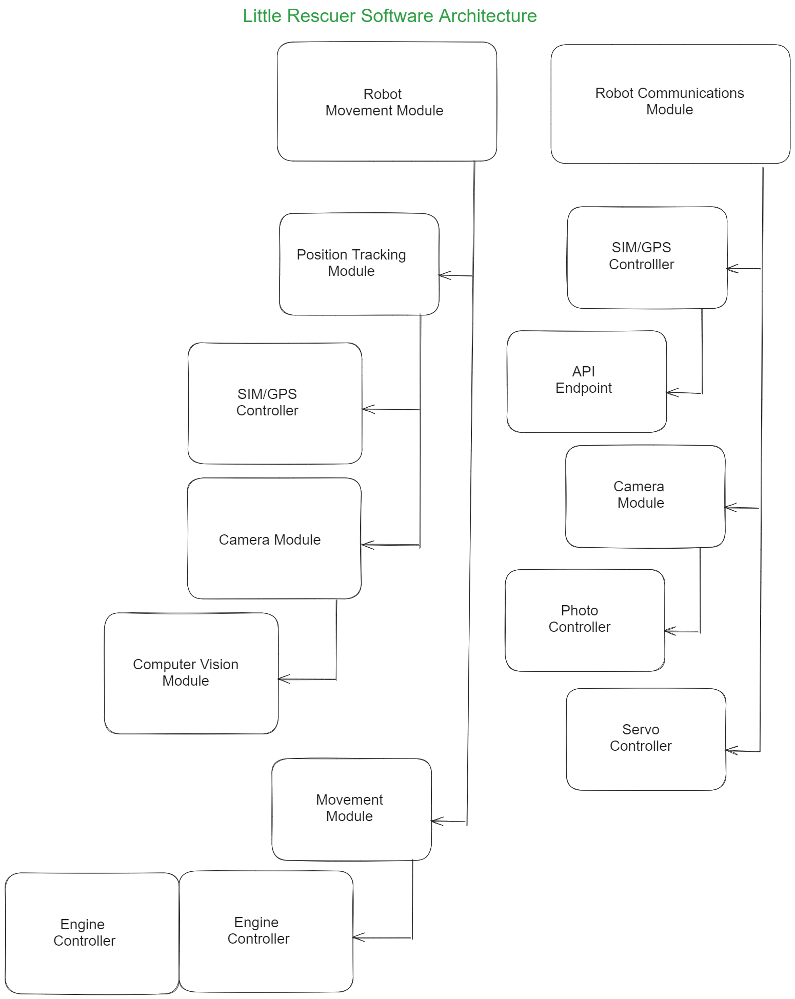

# Little Rescuer

## Description

"Little Rescuer" es el prototipo de un robot autónomo diseñado para intervenir rápidamente en situaciones de emergencia en la carretera. Este ingenioso dispositivo, con forma de automóvil compacto, está equipado con una variedad de funciones inteligentes para garantizar la seguridad y el bienestar de los conductores y pasajeros involucrados en un accidente.

Cuando se produce un accidente, "Little Rescuer" se tiene que dejar en el suelo para que rapidamente se desplaze y se posicione estratégicamente a 200 metros detrás del vehículo afectado.

Una vez en posición, "Little Rescuer" despliega una cámara de alta resolución, que puede girar 180 grados, para capturar imágenes detalladas de la escena del accidente. Estas imágenes se envían de inmediato a las autoridades pertinentes y a los contactos de emergencia designados por el conductor, proporcionando una rápida confirmación de que todos están bien. Una vez realizado el aviso, dicha cámara gira y se queda enfoncando al tráfico para ir controlandolo.

Además de tomar fotografías, "Little Rescuer" activa sus luces intermitentes para alertar a otros conductores sobre la presencia del accidente. Esta función ayuda a prevenir colisiones adicionales y garantiza la seguridad en la carretera.

El robot también está conectado a una red de servicios de emergencia, lo que le permite notificar automáticamente a los equipos de respuesta médica y de rescate sobre el incidente. Esta rápida acción puede ser crucial para garantizar una atención médica oportuna para los heridos.

En resumen, "Little Rescuer" es un valioso aliado en situaciones de emergencia en la carretera, ofreciendo una respuesta rápida y coordinada para proteger la seguridad y el bienestar de todos los involucrados en un accidente de tráfico.

## Install

[Describe how to install or set up the project. Include any prerequisites or dependencies.]

## Library

### Hardware

[Include any hardware-related libraries or dependencies.]

### 3D

[Include any 3D modeling libraries or dependencies.]

### Software Architecture Diagram

## TODOs

- [ ] Task 1
- [ ] Task 2
- [ ] Task 3
- [ ] ...

## Refs

[Include any references or resources related to the project.]
